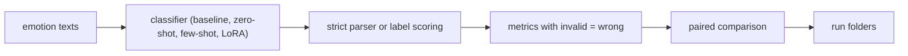
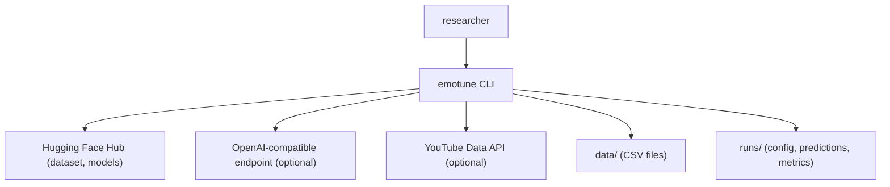
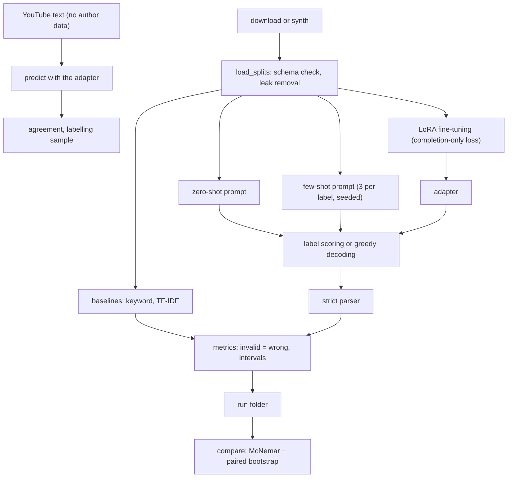

<div align="center">

# emotune — Zero-Shot, Few-Shot And LoRA Language Models For Emotion Labels

**emotune is a reproducible benchmark for 6-label emotion classification with language models. It takes the `dair-ai/emotion` texts through these steps to paired, interval-based comparisons of regimes and models:**

`load and check` → `prompt or fine-tune` → `score or decode` → `parse strictly` → `evaluate and compare`.


**[Summary](#1-summary)** ·
**[Workflow](#4-the-end-to-end-workflow)** ·
**[Run it](#10-how-to-run-emotune)** ·
**[Configuration](#104-environment-variables)** ·
**[Known problems](#13-known-problems)** ·
**[Glossary](#15-glossary)**

</div>

> [!NOTE]
> This README uses ASD-STE100 Simplified Technical English. The writing rules and the project
> vocabulary are in [`docs/ste-style-guide.md`](docs/ste-style-guide.md). Each term in the
> [Glossary](#15-glossary) has only one meaning.

---

emotune compares cheap baselines, zero-shot prompts, few-shot prompts and LoRA adapters on one label schema with one evaluation path. A language model either scores the six label strings or decodes greedily with a strict parser. An invalid answer counts as wrong. Two runs on the same items get a McNemar test and a paired bootstrap interval.

This README is the **one location that explains all of emotune**. It gives these topics:

- the general design
- each component and its procedure, step by step
- the decision rules
- the data map
- the runbook
- the validation results and the known problems

| If you are… | Read |
|---|---|
| A manager or reviewer | [1](#1-summary), [3](#3-design-rules), [4](#4-the-end-to-end-workflow), [12](#12-validation-results), [14](#14-key-points) |
| A developer who joins the project | All sections, in sequence. Keep [10](#10-how-to-run-emotune) and [13](#13-known-problems) open while you work |
| An operator who runs emotune | [10](#10-how-to-run-emotune), then the section for the component that you use |

---

## Table of contents

1. 🧭 [Summary](#1-summary)
2. 🏗️ [How emotune is built](#2-how-emotune-is-built)
   - 2.1 [Components](#21-components)
   - 2.2 [System context](#22-system-context)
   - 2.3 [Repository layout](#23-repository-layout)
3. 🛡️ [Design rules](#3-design-rules)
4. 🔄 [The end-to-end workflow](#4-the-end-to-end-workflow)
   - 4.1 [Full flow](#41-full-flow)
   - 4.2 [The life cycle of one item](#42-the-life-cycle-of-one-item)
5. 🔵 [Data and label schema](#5-data-and-label-schema)
6. 🟢 [Classifiers and regimes](#6-classifiers-and-regimes)
7. 🟣 [LoRA adapters](#7-lora-adapters)
8. ⚖️ [The parsing, metric and comparison rules](#8-the-parsing-metric-and-comparison-rules)
9. 🗂️ [Data and file map](#9-data-and-file-map)
10. ▶️ [How to run emotune](#10-how-to-run-emotune)
    - 10.1 [Prerequisites](#101-prerequisites) · 10.2 [Installation](#102-installation) · 10.3 [Run emotune](#103-run-emotune) · 10.4 [Environment variables](#104-environment-variables)
11. 🧩 [How to extend emotune](#11-how-to-extend-emotune)
12. ✅ [Validation results](#12-validation-results)
13. ⚠️ [Known problems](#13-known-problems)
14. 📌 [Key points](#14-key-points)
15. 📖 [Glossary](#15-glossary)
16. 📄 [License](#16-license)

---

## 1. Summary

**The problem.** An LLM classification benchmark can give a wrong ranking because of label mapping, parsing and evaluation details. The difficult questions are:

- Does every module use the same label ids?
- Does the parser give a label for a rambling answer, or does it bias the result to the first label in a list?
- Do invalid answers leave the denominator and make a weak model look good?
- Is the run repeatable: greedy decoding, chat templates, pinned revisions, seeds?
- Does the fine-tuning loss learn the label, or the prompt and the padding?
- Is a comparison of two models fair, and does its test have meaning?

emotune gives each question its own rule, its own code and its own tests.

| Item | Value |
|---|---|
| Input | `train.csv`, `validation.csv`, `test.csv` with `text` and `label` (0..5) |
| Output | Run folders: `config.json`, `predictions.jsonl`, `metrics.json`, `report.md` |
| Components | **7**: label schema, data, prompts and parser, classifiers, fine-tuning, metrics, runs |
| Providers | Hugging Face models (extra `hf`), LoRA with PEFT (extra `finetune`), any OpenAI-compatible endpoint, YouTube Data API. All optional |
| Offline mode | Synthetic data, the keyword and TF-IDF baselines, the simulated chat model |
| Safety | Keys from the environment only, a key scan test, YouTube text without author data |
| Tests | **43** unit tests (`pytest`). In CI, 41 pass and 2 skip (torch) |



---

## 2. How emotune is built

### 2.1 Components

| Component | Module | Purpose |
|---|---|---|
| Label schema | `src/emotune/labels.py` | The ordered `LABELS` tuple and id conversion |
| Data | `src/emotune/data.py` | CSV schema checks, leak removal, few-shot sampler, synthetic data, Hub download |
| Prompts | `src/emotune/prompts.py` | Versioned chat messages for zero-shot and few-shot |
| Parser | `src/emotune/parse.py` | Strict answer parser |
| Baselines | `src/emotune/backends/baselines.py` | Keyword lexicon and TF-IDF with logistic regression |
| Chat classifiers | `src/emotune/backends/chat.py` | OpenAI-compatible client, simulated chat model, scripted model |
| Hugging Face | `src/emotune/backends/hf.py` | Label scoring, greedy decoding, adapter loading (extra `hf`) |
| Fine-tuning | `src/emotune/finetune.py` | Completion-only examples, dynamic padding, LoRA training (extra `finetune`) |
| Metrics | `src/emotune/metrics.py` | Accuracy, macro-F1, per-label scores, intervals, McNemar, agreement |
| Runs | `src/emotune/runs.py` | Model specs, like-for-like check, run folders and reports |
| YouTube | `src/emotune/youtube.py` | Comment text collection without author data, labelling sample |
| CLI | `src/emotune/cli.py` | The `emotune` command |

### 2.2 System context



### 2.3 Repository layout

```
emotune/
├── configs/models.toml        model ids, revisions and kinds
├── data/README.md             dataset source, terms, file schema
├── docs/ste-style-guide.md    writing rules and project vocabulary
├── src/emotune/
│   ├── labels.py data.py prompts.py parse.py
│   ├── metrics.py runs.py finetune.py youtube.py config.py
│   ├── backends/              base, baselines, chat, hf
│   └── cli.py                 the emotune command
├── tests/                     pytest suite
└── pyproject.toml             package, extras and the console script
```

---

## 3. Design rules

### 3.1 One label schema
`labels.LABELS` is an ordered tuple in the `ClassLabel` order of `dair-ai/emotion`. Every module converts names and ids through it. `download` stops if the dataset order differs.

### 3.2 Strict parsing or label scoring
The parser accepts an answer only if its first line holds exactly one label as a whole word. "enjoy" is not "joy", and "joy or sadness" is invalid. The label scorer ranks the six label strings by log-likelihood, so it cannot give an invalid answer.

### 3.3 Invalid answers count as wrong
Every metric uses all items. An invalid prediction is a false negative for its true label. The report also gives the invalid rate.

### 3.4 Repeatable runs
Hugging Face runs use greedy decoding or label scoring, the chat template of the tokenizer and a pinned revision. The decoded answer is cut by token position. Each run saves the model, the revision, the kind, the prompt version, the seed and the decoding method.

### 3.5 Completion-only loss with dynamic padding
`build_example` gives the prompt tokens the label -100. `collate` pads a batch to its longest example and gives the padding the label -100. The loss sees only the label tokens and the end-of-sequence token.

### 3.6 Fair comparisons
`check_like_for_like` refuses a comparison of a base model with an instruct model. `compare` needs labelled runs of the same items in the same order. For unlabelled texts, `agreement` gives only the agreement rate and Cohen's kappa, never a test of accuracy.

### 3.7 Fine-tuned predictions use the adapter
`llm --adapter` and `predict --adapter` load the base model plus the LoRA adapter. A fine-tuned run is marked `fine_tuned` in its config.

### 3.8 Privacy and keys
The YouTube collector keeps the comment text and a salted hash of the comment id only. Keys come from the environment or a local `.env` file. A test scans all tracked files for key patterns.

---

## 4. The end-to-end workflow

### 4.1 Full flow



### 4.2 The life cycle of one item

1. `load_csv` reads the text and checks that the label is an integer in 0..5.
2. `load_splits` removes the item from train if its text is also in validation or test.
3. The classifier makes the prompt: zero-shot, or few-shot with 18 seeded shots.
4. The model returns label scores or an answer.
5. `parse_label` turns the answer into one label or `invalid`.
6. `classification_metrics` puts the prediction into accuracy, macro-F1, per-label scores and the confusion matrix.
7. `save_run` writes the item, the prediction and the raw answer to `predictions.jsonl`.
8. `compare` pairs the item with the same item of another run.

---

## 5. Data and label schema

**Purpose.** Give every classifier the same, checked items.

| Input | Output |
|---|---|
| Three CSV files | `train`, `validation`, `test` lists of `Example(text, label)`, and the count of removed leaked rows |

**Procedure**

1. Check the columns `text` and `label`, non-empty text and labels in 0..5.
2. Remove each train item whose case-folded text is also in validation or test.
3. For few-shot, draw `k` train items of each label with a seeded generator, then shuffle them.

| Id | Label |
|---|---|
| 0 | `sadness` |
| 1 | `joy` |
| 2 | `love` |
| 3 | `anger` |
| 4 | `fear` |
| 5 | `surprise` |

---

## 6. Classifiers and regimes

**Purpose.** Give one prediction for each item under one regime.

| Classifier | Regime | Needs | Decoding |
|---|---|---|---|
| `KeywordBaseline` | `baseline` | nothing | lexicon counts. A tie or no match is `invalid` |
| `TfidfBaseline` | `baseline` | scikit-learn | TF-IDF words and bigrams with logistic regression, fit on train only |
| `ChatClassifier` + `OpenAICompatibleLLM` | `zero_shot`, `few_shot` | an endpoint and a key | temperature 0, at most 5 tokens, strict parser |
| `HFLabelScorer` | `zero_shot`, `few_shot`, `fine_tuned` | extra `hf` | log-likelihood of the six label strings |
| `HFGreedyGenerator` | `zero_shot`, `few_shot`, `fine_tuned` | extra `hf` | greedy, at most 6 new tokens, strict parser |
| `ChatClassifier` + `SimulatedChatLLM` | `zero_shot`, `few_shot` | nothing | seeded stand-in, marked `simulated` |

**Procedure (chat classifier)**

1. Build the messages: the system rule with the six labels, then the shots as user and assistant turns, then the text.
2. Call the model. If the call fails, record the error as the answer and predict `invalid`.
3. Parse the answer strictly.

**Rules**

- The few-shot prompt shows each shot as a real exchange, so the answer format is shown, not only described.
- The prompt version (`PROMPT_VERSION`) goes into every run config.

---

## 7. LoRA adapters

**Purpose.** Train a LoRA adapter that learns the label tokens only.

| Input | Output |
|---|---|
| A model from `configs/models.toml`, train and validation items | `adapter/` folder with the LoRA weights and the tokenizer |

**Procedure**

1. Load the model at its pinned revision, in 4-bit NF4 if `load_in_4bit` is true.
2. Add LoRA to `q_proj`, `k_proj`, `v_proj` and `o_proj` (r 16, alpha 32, dropout 0.05).
3. Encode each item: the chat-templated zero-shot prompt, then the label tokens and the end-of-sequence token.
4. Give the prompt tokens the label -100. Cut the prompt from the left if the item is longer than 256 tokens.
5. Pad each batch to its longest item. Give the padding the label -100.
6. Train with evaluation on validation after each epoch. Keep the epoch with the lowest validation loss.
7. Evaluate with `emotune llm --backend hf-score --adapter <folder>`.

---

## 8. The parsing, metric and comparison rules

**Parser.**

| Answer | Prediction |
|---|---|
| `joy`, `Joy.`, `ANGER` then more lines | the label |
| `Label: fear`, `The emotion is love.` | the label (one label word in the first line) |
| `enjoy`, `joyful` | `invalid` (no whole-word match) |
| `joy or sadness`, `It could be anger or maybe fear.` | `invalid` (two labels) |
| empty, `I cannot tell.` | `invalid` |

**Metrics.**

| Metric | Rule |
|---|---|
| `accuracy` | Correct predictions over all items, with a 95% bootstrap interval (1000 resamples) |
| `macro_f1` | Mean F1 over the six labels. An invalid prediction is a false negative. 95% bootstrap interval |
| `weighted_f1` | F1 weighted by label support |
| `invalid_rate` | Share of invalid predictions |
| `per_class` | Precision, recall, F1 and support per label |
| `confusion` | 6 rows (true labels) × 7 columns (six labels and `invalid`) |

**Comparisons.**

| Command | Needs | Gives |
|---|---|---|
| `compare` | Two labelled runs of the same items, models of one kind | Accuracy difference with a paired bootstrap interval, exact McNemar test |
| `agreement` | Two runs of the same items, labels not needed | Agreement rate, Cohen's kappa, invalid rates. No p-value |

---

## 9. Data and file map

| Path | Committed? | Contents |
|---|---|---|
| `configs/models.toml` | Yes | Model ids, revisions and kinds |
| `data/README.md` | Yes | Dataset source, terms and file schema |
| `data/emotion/*.csv` | No (git ignores it) | The benchmark data |
| `data/synthetic/*.csv` | No (git ignores it) | Synthetic data |
| `data/youtube/*.csv` | No (git ignores it) | Comment text with hashed ids, labelling sample |
| `runs/<name>/` | No (git ignores it) | `config.json`, `predictions.jsonl`, `metrics.json`, `report.md` |
| `runs/lora_<model>/adapter/` | No (git ignores it) | LoRA adapter |
| `.env` | No (git ignores it) | Local settings and keys |
| `.env.example` | Yes | Names of the environment variables |

---

## 10. How to run emotune

### 10.1 Prerequisites

| Need | For |
|---|---|
| Python 3.11+ | All components |
| A CUDA GPU with at least 16 GB | 7B to 8B models with the `hf` and `finetune` extras |
| Hugging Face access to gated models and `HF_TOKEN` | Llama and Mistral checkpoints |
| An OpenAI-compatible endpoint and a key | `--backend openai` |
| `YOUTUBE_API_KEY` and `EMOTUNE_HASH_SALT` | `collect-youtube` |

### 10.2 Installation

```bash
git clone https://github.com/KrishnaAnnavaram/emotune.git
cd emotune
python -m venv .venv
. .venv/bin/activate            # Windows: .venv\Scripts\activate
pip install -e ".[dev]"         # core and tests
pip install -e ".[finetune]"    # torch, transformers, peft, bitsandbytes, datasets (optional)
```

### 10.3 Run emotune

```bash
# offline demo: synthetic data, two baselines, a simulated chat model in two regimes
emotune demo

# data
emotune download --out data/emotion --revision <dataset commit hash>

# baselines
emotune baseline --data data/emotion --model tfidf --run tfidf_test
emotune baseline --data data/emotion --model keyword --run keyword_test

# zero-shot and few-shot with a Hugging Face model (label scoring or greedy decoding)
emotune llm --data data/emotion --backend hf-score --model llama-3.1-8b-instruct --regime zero_shot --load-in-4bit
emotune llm --data data/emotion --backend hf-greedy --model llama-3.1-8b-instruct --regime few_shot --shots 3 --load-in-4bit

# zero-shot through an OpenAI-compatible endpoint
emotune llm --data data/emotion --backend openai --regime zero_shot --limit 500

# LoRA fine-tuning, then evaluation with the adapter
emotune finetune --data data/emotion --model llama-3.1-8b-instruct
emotune llm --data data/emotion --backend hf-score --model llama-3.1-8b-instruct --adapter runs/lora_llama-3.1-8b-instruct/adapter --run llama_lora

# paired comparison of two labelled runs
emotune compare runs/llama_lora runs/tfidf_test

# domain shift: YouTube text, predictions with the adapter, a sample for human labels
emotune collect-youtube --videos <video id> <video id> --out data/youtube/comments.csv
emotune predict --input data/youtube/comments.csv --backend hf-score --model llama-3.1-8b-instruct --adapter runs/lora_llama-3.1-8b-instruct/adapter --run yt_llama_lora
emotune label-sample --comments data/youtube/comments.csv --n 300 --out data/youtube/to_label.csv
```

### 10.4 Environment variables

| Variable | Used by | Meaning |
|---|---|---|
| `EMOTUNE_DATA_DIR` | data commands | Data folder. Default `data/emotion` |
| `EMOTUNE_RUNS_DIR` | all commands with output | Run folder. Default `runs` |
| `EMOTUNE_SEED` | all | Seed of the sampler, the baselines and training. Default `0` |
| `EMOTUNE_LLM_BASE_URL` | `--backend openai` | Default `https://api.openai.com/v1` |
| `EMOTUNE_LLM_MODEL` | `--backend openai` | Default `gpt-4o-mini` |
| `EMOTUNE_LLM_API_KEY` | `--backend openai` | Endpoint key |
| `HF_TOKEN` | hf backends, `finetune` | Hugging Face token for gated models |
| `YOUTUBE_API_KEY` | `collect-youtube` | YouTube Data API key |
| `EMOTUNE_HASH_SALT` | `collect-youtube` | Salt of the comment id hash |

Credentials are only in a local `.env` file. Git ignores this file. Do not print or commit credentials.

---

## 11. How to extend emotune

| You want to… | Do this | Code change? |
|---|---|---|
| Add a model | Add an entry with a pinned revision and its kind to `configs/models.toml` | No |
| Use a local server | Set `EMOTUNE_LLM_BASE_URL` to `http://localhost:<port>/v1` | No |
| Change the prompt | Edit `prompts.py` and increase `PROMPT_VERSION` | Small |
| Add a baseline | Write a class with `name` and `predict(texts)` that returns `Prediction` objects | Small |
| Add a sequence-classification baseline | Add a backend with `AutoModelForSequenceClassification` and the same interface | Yes |
| Use another label set | Change `LABELS` and the dataset check in `download_hf` | Small |

---

## 12. Validation results

| Validation | Result | Command |
|---|---|---|
| Unit tests (torch installed) | **43 passed** | `pytest -q` |
| Unit tests in CI (no torch) | **41 passed, 2 skipped** | `pip install -e ".[dev]"` then `pytest -q` |
| Offline demo on synthetic data | See the table below | `emotune demo` |

**Offline demo (synthetic data, seed 0).** 1200 train items (3 leaked rows removed) and 300 test items. Ten percent of the labels are random, so the best possible accuracy is near 0.92.

| Classifier | Regime | Accuracy [95% CI] | Macro-F1 | Invalid |
|---|---|---|---|---|
| `keyword` | baseline | 0.917 [0.883, 0.947] | 0.916 | 0.0% |
| `tfidf-logreg` | baseline | 0.917 [0.883, 0.947] | 0.916 | 0.0% |
| `simulated-chat-seed0` (SIMULATED) | zero-shot | 0.550 [0.493, 0.613] | 0.577 | 10.7% |
| `simulated-chat-seed0` (SIMULATED) | few-shot | 0.683 [0.627, 0.737] | 0.732 | 15.0% |

The keyword lexicon holds the synthetic cue words, so both baselines reach the noise limit. The simulated chat model has a fixed skill and a fixed share of rambling answers. Its rows show that the parser, the invalid counting and the run folders work. They are not a measurement of a language model.

The prototype reported accuracy 0.909 for a Llama-3.1-8B QLoRA adapter and 0.893 for a Mistral-7B QLoRA adapter on the 2000 test texts. These are prototype results, not reproduced here. They came from code with label-mapping and evaluation problems.

---

## 13. Known problems

Read these problems before you publish a result from emotune.

| # | Area | Problem | Impact and action |
|---|---|---|---|
| 1 | Results | No language-model result is reproduced in this repository or in CI | Run the `hf` commands on a GPU and publish the run folders with the revisions |
| 2 | Revisions | `configs/models.toml` uses `main` as the revision | Replace it with a commit hash before a published run |
| 3 | Hugging Face code | The model loading, label scoring with real models and LoRA training run only with model weights. CI tests only their pure parts | Do a small run (`--limit 50`) before a full run |
| 4 | Label scoring | A label with more tokens gets a lower summed log-likelihood | Compare greedy and scoring runs. Length normalisation is not added |
| 5 | Parser | An answer with the label on a later line is invalid | This is strict on purpose. Read the raw answers in `predictions.jsonl` |
| 6 | Dataset | `dair-ai/emotion` labels come from hashtags. They are noisy and the label shares are not equal | Report macro-F1 next to accuracy |
| 7 | Domain shift | The YouTube step needs human labels for any accuracy claim | Use `label-sample`, label the sample, then use `compare` on it |
| 8 | Cost | Few-shot prompts with 18 shots are long | Use `--limit` for API runs |

**Responsible use.** emotune is not a mental-health assessment tool. Do not use it to make decisions about a person. A human must review any use of its predictions. The dataset has bias in language, topic and the people who wrote the texts.

---

## 14. Key points

1. **One label schema.** The tuple order is the dataset order, and a test checks every name and id.
2. **Strict parsing, invalid counts as wrong.** No substring match, and no item leaves the denominator.
3. **Repeatable runs.** Greedy decoding or label scoring, chat templates, pinned revisions and saved configs.
4. **The loss sees only the label.** Prompt and padding tokens get the label -100, with dynamic padding.
5. **Comparisons have meaning.** Like-for-like models, McNemar on labelled items only, agreement for unlabelled text.

---

## 15. Glossary

| Term | Meaning |
|---|---|
| **label** | One of `sadness`, `joy`, `love`, `anger`, `fear`, `surprise` |
| **label schema** | The ordered tuple `LABELS`. The position of a name is its id |
| **item** | One text with its true label |
| **shot** | One train item that a few-shot prompt shows |
| **leaked row** | A train item whose text is also in validation or test |
| **regime** | `baseline`, `zero_shot`, `few_shot` or `fine_tuned` |
| **kind** | `base` or `instruct` |
| **revision** | The commit hash of a model or dataset on the Hub |
| **adapter** | The trained LoRA weights for one base model |
| **invalid** | An answer that is not exactly one label. It counts as wrong |
| **label scoring** | Prediction by the highest log-likelihood of the label strings |
| **completion-only loss** | A loss on the answer tokens only |
| **run** | One folder with the config, the predictions, the metrics and the report |
| **agreement** | The share of equal predictions of two runs, with Cohen's kappa |

---

## 16. License

[MIT](LICENSE) © 2026 Krishna Annavaram
